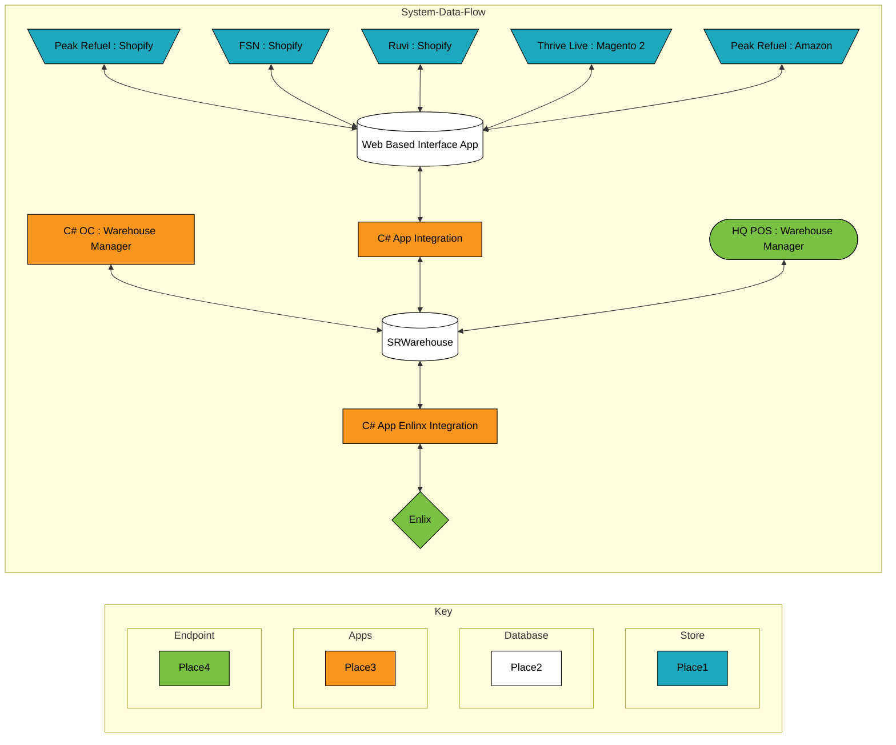

# Welcome to the Thrivelife Web Dev Team!

This file will help you onboard into your new position as a web development quality assurance technician. The main responsibility of a QA tech is to ensure high quality work flows between business personnel and our developers. This guide will dig into each pillar of the role, what you can expect, and how to use the tools provided.

# Table of Contents
- [Tools](#tools)
	- [BitBucket](#bitbucket)
	- [Git](#git)
	- [Google_Office](#google_office)
	- [KeePass 2](#keepass_2)
	- [Screencast](#screencast)
	- [Slack](#slack)
	- [SQL_Editor](#sql_editor)
	- [VPN](#vpn)
- [Business Rules](#business_rules)
	- [The_Ws](#the_ws)
  - [Public_Pages](#public_pages)
  - [Delivery_Service](#delivery_service)
  - [Consultant_Tools](#consultant_tools)
  - [Refer_A_Friend](#refer_a_friend)
  - [Recipe_Site](#recipe_site)
- [Tron](#tron)
  - [Sprints](#sprints)
  - [Navigation](#navigation)
	  - [New_Tickets](#new_tickets)
	  - [Browse_Tickets](#browse_tickets)
  - [Taskboard](#taskboard)

# Tools
## BitBucket
## Git
## Google_Office
## KeePass_2
## Screencast
## Slack
## SQL_Editor
## VPN
  
# Business_Rules

Thrivelife is one business of many that we support with manufacturing. As a web dev QA, your sole priority is to support [Thrivelife](https://www.thrivelife.com/). However, you may be asked to support other entities. 

## The_Ws
## Public_Pages
## Delivery_Service
## Consultant_Tools
## Refer_A_Friend
## Recipe_Site

# Tron
## Agile (Scrum Theory)
## Sprints
## Navigation
### New_Tickets
### Browse_Tickets
## Taskboard

# Systems
## Data_Flow

